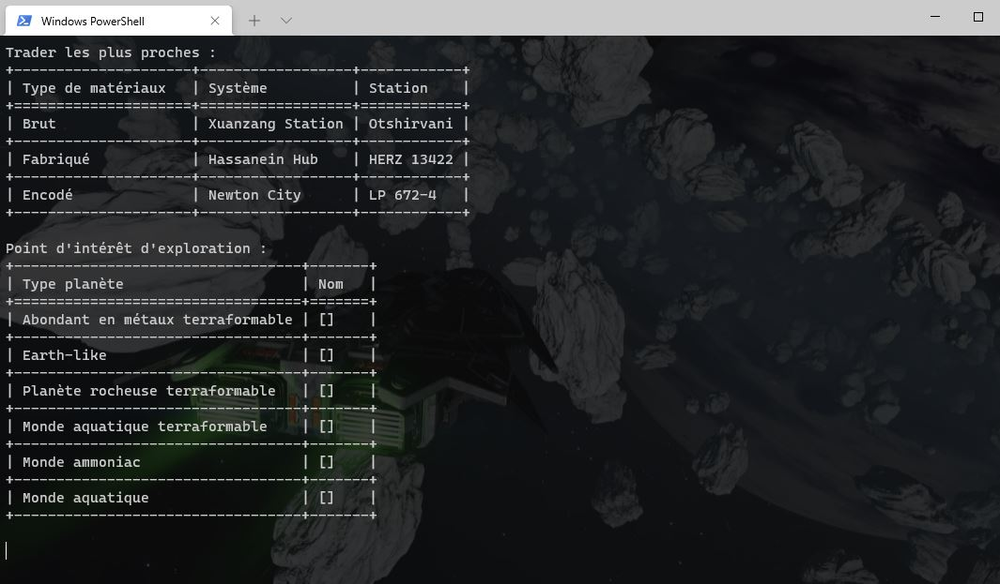

# pydangerous



## Infos

Script en console qui affiche en temps réel les traders les plus proche par type de matériaux et les planète du système qui rapporte le plus en exploration

## Prérequis

- Python > 3.9
- beautifulsoup
- requests
- tabulate

## Installation et utilisation sous windows

Installer python avec pip : https://www.python.org/downloads/ (bien cocher ADD PATH et dans avancé vérifier que tout soit coché également)
Ouvrez un terminal et taper les commandes suivantes :
```
git clone https://gitlab.com/noxas69/pydangerous.git
cd pydangerous
pip install -r requirements.txt
py app.py
```

## Installation et utilisation sous linux
```
sudo apt install python3
sudo apt install python3-pip
git clone https://gitlab.com/noxas69/pydangerous.git
cd pydangerous
pip3 install -r requirements.txt
python3 app.py
```

Penser à modifier la variable "LOG_PATH" dans le fichier app.py pour indique le répertoire ou se situe les log du jeu (sous la forme Journal.220109133308.01.log).
Si vous ne savez pas ou ils sont stocker, taper cette commande pour les localiser :
```
find / -name "Journal*.log" -type f
```


